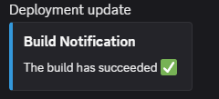
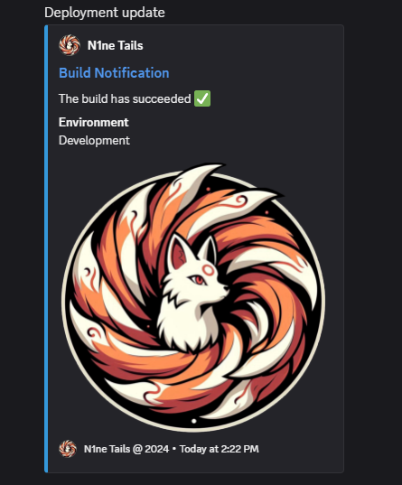

# N1netails

<div align="center">
  
</div>

[](LICENSE)


# Discord Webhook Client
N1netails is an open-source project that provides practical alerts and monitoring for applications. 
Use the N1netails Discord Webhook Client to easily send webhook messages to a discord server.

## How to set up a discord server
Use the following documents to create a discord server and discord webhooks. N1ne Tails Discord Webhook Client will 
utilize the discord webhook to the target discord server.

### Create discord server
https://support.discord.com/hc/en-us/articles/204849977-How-do-I-create-a-server

### Create discord webhook
https://support.discord.com/hc/en-us/articles/228383668-Intro-to-Webhooks

## Install
Install the discord webhook client by adding the following dependency:
```xml
<dependency>
    <groupId>com.n1netails</groupId>
    <artifactId>n1netails-discord-webhook-client</artifactId>
    <version>0.3.0</version>
</dependency>
```

Gradle (Groovy)
```groovy
implementation 'com.n1netails:n1netails-discord-webhook-client:0.3.0'
```

## Configure
Here is how you can configure the project for different frameworks

### Spring Boot
Add the following beans to your spring boot application:

```java
import com.n1netails.n1netails.discord.api.DiscordWebhookClient;
import com.n1netails.n1netails.discord.internal.DiscordWebhookClientImpl;
import com.n1netails.n1netails.discord.service.WebhookService;
import org.springframework.context.annotation.Bean;
import org.springframework.context.annotation.Configuration;

@Configuration
public class DiscordWebhookConfig {

    @Bean
    public WebhookService webhookService() {
        return new WebhookService();
    }

    @Bean
    public DiscordWebhookClient discordWebhookClient(WebhookService service) {
        return new DiscordWebhookClientImpl(service);
    }
}
```

### Java

```java
import com.n1netails.n1netails.discord.internal.DiscordWebhookClientImpl;
import com.n1netails.n1netails.discord.service.WebhookService;

WebhookService service = new WebhookService();
DiscordWebhookClient client = new DiscordWebhookClientImpl(service);
```

## Use
Discord webhook resource:
https://discord.com/developers/docs/resources/webhook

### Simple Example
```java
import com.n1netails.n1netails.discord.api.DiscordWebhookClient;
import com.n1netails.n1netails.discord.internal.DiscordWebhookClientImpl;
import com.n1netails.n1netails.discord.service.WebhookService;
import com.n1netails.n1netails.discord.model.WebhookMessage;

public class ExampleService {
    private final DiscordWebhookClient webhookClient;

    public ExampleService() {
        this.webhookClient = new DiscordWebhookClientImpl(new WebhookService());
    }

    public void webhookExample(String content) {
        WebhookMessage message = new WebhookMessage(content);
        // replace with your discord webhook url
        String webhookUrl = "https://discord.com/api/webhooks/xxx/yyy";
        webhookClient.sendMessage(webhookUrl, message);
    }
}
```

#### Example message output
<div align="center">
  
</div>

### Detailed Example
Includes embeds, fields, and action buttons.

```java
import com.n1netails.n1netails.discord.DiscordColor;
import com.n1netails.n1netails.discord.api.DiscordWebhookClient;
import com.n1netails.n1netails.discord.model.*;
import java.util.Collections;
import java.time.Instant;

public class DetailedExample {
    public void sendDetailedMessage(DiscordWebhookClient client, String webhookUrl) {
        Embed.EmbedField field = new Embed.EmbedField();
        field.setName("Environment");
        field.setValue("Production");
        field.setInline(true);

        Embed embed = new EmbedBuilder()
            .withTitle("System Update")
            .withDescription("All systems are operational 🚀")
            .withColor(DiscordColor.GREEN.getValue())
            .withFields(Collections.singletonList(field))
            .withTimestamp(Instant.now().toString())
            .build();

        Component button = new ComponentBuilder()
            .withType(Component.BUTTON)
            .withStyle(Component.LINK)
            .withLabel("View Dashboard")
            .withUrl("https://n1netails.com/")
            .build();

        Component actionRow = new ComponentBuilder()
            .withType(Component.ACTION_ROW)
            .withComponents(Collections.singletonList(button))
            .build();

        WebhookMessage msg = new WebhookMessageBuilder()
            .withUsername("Monitor Bot")
            .withContent("Weekly report is ready!")
            .withEmbeds(Collections.singletonList(embed))
            .withComponents(Collections.singletonList(actionRow))
            .build();

        client.sendMessage(webhookUrl, msg);
    }
}
```

### Image and GIF Example
You can add images or GIFs via URL in the embed or as a message attachment.

```java
import com.n1netails.n1netails.discord.model.*;
import java.util.Collections;

public class ImageGifExample {
    public void sendMedia(DiscordWebhookClient client, String webhookUrl) {
        // Image in Embed
        String gifUrl = "https://media2.giphy.com/media/v1.Y2lkPTc5MGI3NjExc2czZjNjbWljd3lva3lvem15NjJoZHptbmR0Y2Z2eWRjaXYzMXF6cyZlcD12MV9pbnRlcm5hbF9naWZfYnlfaWQmY3Q9Zw/xsE65jaPsUKUo/giphy.gif";
  
        Embed.Image gif = new Embed.Image();
        gif.setUrl(gifUrl);
  
        Embed embed = new EmbedBuilder()
                .withTitle("GIF Example")
                .withImage(gif)
                .build();
  
        WebhookMessage msg = new WebhookMessageBuilder()
                .withEmbeds(Collections.singletonList(embed))
                .build();

      client.sendMessage(webhookUrl, msg);
    }
}
```

### Video Example
Videos can be included via URL in the message content (Discord will embed it automatically) or as a file attachment.

```java
import com.n1netails.n1netails.discord.model.*;
import java.util.Collections;

public class VideoExample {
    public void sendVideo(DiscordWebhookClient client, String webhookUrl, byte[] videoData) {
        // Video via URL in content
        String videoUrl = "https://n1netails.nyc3.cdn.digitaloceanspaces.com/video_2026-02-11_18-16-07.mp4";
        videoData = downloadToBytes(videoUrl);
  
        // Video as file attachment
        WebhookFile file = new WebhookFile("video_2026-02-11_18-16-07.mp4", videoData);
  
        WebhookMessage msg = new WebhookMessageBuilder()
                .withContent("New video uploaded!")
                .withFiles(Collections.singletonList(file))
                .build();
  
        client.sendMessage(webhookUrl, msg);
    }
}

public static byte[] downloadToBytes(String fileUrl) throws IOException {
  URL url = new URL(fileUrl);

  try (InputStream in = url.openStream();
       ByteArrayOutputStream buffer = new ByteArrayOutputStream()) {

    byte[] chunk = new byte[8192];
    int bytesRead;

    while ((bytesRead = in.read(chunk)) != -1) {
      buffer.write(chunk, 0, bytesRead);
    }

    return buffer.toByteArray();
  }
}
```

## Available Models
Send customized webhooks by utilizing the n1netails Pojo's 
- `WebhookMessage`
  - `content`
  - `username`
  - `avatar_url`
  - `tts`
  - `embeds`
  - `components`
  - `files`
- `Embed`
  - `title`
  - `description`
  - `url`
  - `color`
  - `author`
    - `name`
    - `url`
    - `icon_url`
  - `fields`
    - `name`
    - `value`
    - `inline`
  - `footer`
    - `text`
    - `icon_url`
  - `image`
    - `url`
  - `thumbnail`
    - `url`
  - `timestamp`
- `Component`
  - `type`
  - `style`
  - `label`
  - `emoji`
    - `id`
    - `name`
    - `animated`
  - `custom_id`
  - `url`
  - `disabled`
  - `components`
- `WebhookFile`
  - `filename`
  - `data`

#### Example customized message output
<div align="center">
  
</div>

# Develop
## Build
Build the project using the following command
```bash
mvn clean install
```

## Maven Central Repository
Use the following doc to get setup with publishing to the maven central repository
https://central.sonatype.org/register/central-portal/#publishing

Maven install using release profile.
```bash
mvn clean install -P release
```

Maven deploy to the maven central repository
```bash
mvn deploy -P release
```

## Support

For community users, open an issue on GitHub or Join our Discord

[](https://discord.gg/ma9CCw7F2x)

## Contributing

Please use the following guidelines for contributions [CONTRIBUTING](./contributing.md)

## N1netails Discord Webhook Client Contributors

Thanks to all the amazing people who contributed to N1netails Discord Webhook Client! 💙

[](https://github.com/n1netails/n1netails-discord-webhook-client/graphs/contributors)

